# Background
Statistical analysis has a seemingly ever-increasing presence in modern sports dialogue, and the National Basketball Association is no exception to this trend. 

As a self-proclaimed NBA fan, I often find myself frustrated by the lack of contextualization on talk shows for the statistics being cited. There's a passive implication that the viewer should not only care about these metrics, but understand what they mean for a team or player. I find efficiency metrics to be particularly frustrating. It's certainly worthwhile to note an individual's performance, but do efficiency metrics truly capture an individual's contribution to his team's success?


# In an attempt to tackle this question, let's investigate the predictivity of NBA regular season wins based on a team roster's individual efficiency metrics from the prior year.
## In other words, to what extent is an individual's efficiency metric score indicative of his team's future success, and are all efficiency metrics equally predictive?

There are a handful of basketball efficiency metrics that are worth invesitgating here:

Martin Manley's Efficiency ('EFF') = ((Points + Rebounds + Assists + Steals + Blocks) - (Missed Field Goals + Missed Free Throws + Turnovers))/ Games Played

European Performance Index Rating ('PIR') = ((Points + Rebounds + Assists + Steals + Blocks + Fouls Drawn) - (Missed Field Goals + Missed Free Throws + Turnovers + Shots Rejected + Fouls Committed))/ Games Played

Plus-Minus Avg('+/-') = Seasonal plus-minus / Games Played : This describes the point differential for each game with a player on the floor without keeping track of more specific individual metrics. I.e., how does the score spread change when a player is in the game?

Note: We will not be considering John Hollinger's Player Efficiency Rating ('PER'): It is the most frequently used alternative, however PER is derived by a complex calculation designed to compensate for different teams' varying style of play, among other factors, and PER scores do not differ markedly from EFF scores. 

Additionally, because players may change teams from year to year, the PER score from the prior year may misrepresent the player's efficiency within the context of the new team's possibly different style of play. 

Lastly, looking at these raw statistics may help inform to what extent coaches and team managements should prioritize the various efficiency metrics when desiging line-ups and making roster changes.

# Data
I pulled the most recent 20 seasons of NBA player data utilizing swar's nba_api - https://github.com/swar/nba_api.
This data stack was comprised of just over 13,000 player/season pairs and the player's corresponding statistics for that season.

This API pulls data from stats.nba.com. MongDB was utilized for data storage.

The various api scraping scripts can be found in the following files in this repository: nba_player_scraper.ipynb, nba_roster_scraper.ipynb, nba_team_scraper.ipynb

A full procedural breakdown of the statistical methods and functions used in this study can be found in the data_and_plots.ipynb file in this repository.

# Workflow


## Procedure:
Generate team rosters pertinent to the beginning of each season, and pull each indiviual players average efficiency metric from the prior season. Rank the metrics hierarchically - to compare players of equal hierarchy across teams - and use as features in a gradient-boosted regression fitting against the regular season wins for a particular team.


## Distributions of our EFF, PIR, and +/- metrics.

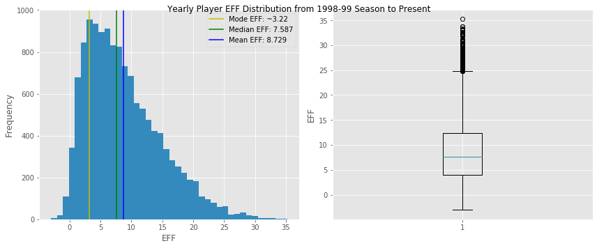

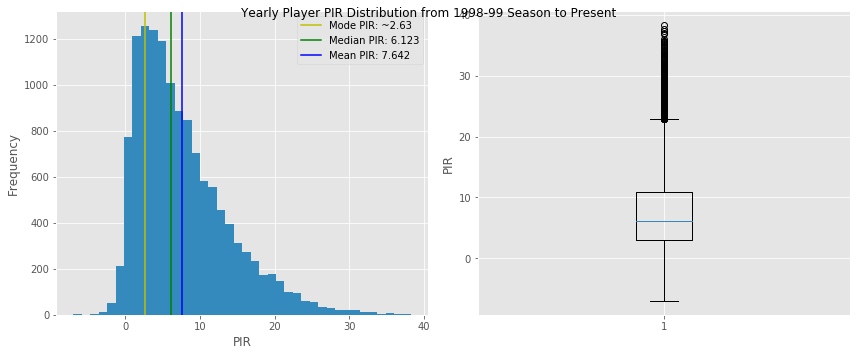

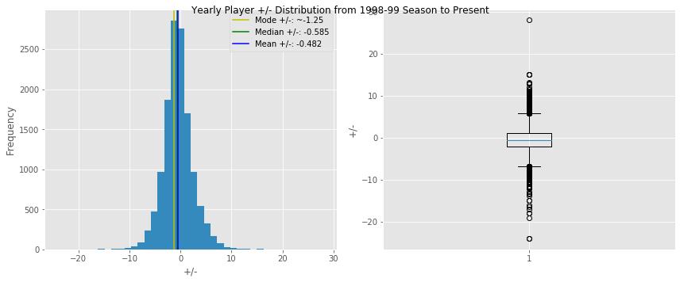

## Distribution of Regular Season Wins

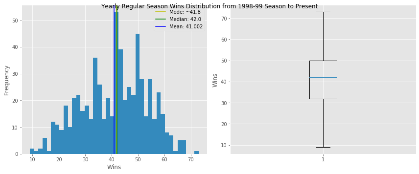

## Let's begin fitting and experimenting with the number of features to see if there's an optimal number of best player individual efficiency scores to include per team. A range of 5 to 17 feels approriate as 5 players need to be on the floor at a given time, and there can be a maximum of 17 players on the active roster of a team.

## We'll look at individual EFF, PIR, and +/- scores

Because none of our data is categorical, and we can't ensure a linear relationship between our features and targets, a GradientBoost Regressor feels appropriate for regular season wins predictions.

Here is an example of an X and y set for fitting our models - Top 10 EFF scores from prior year on a roster vs regular season wins:
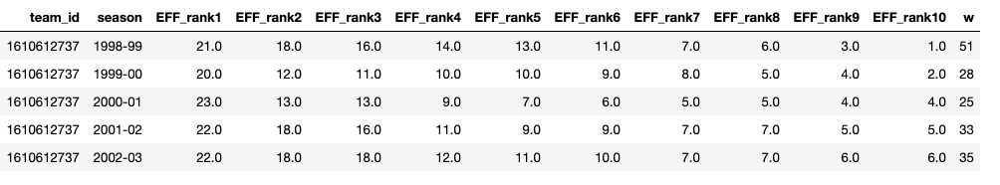

## EFF results

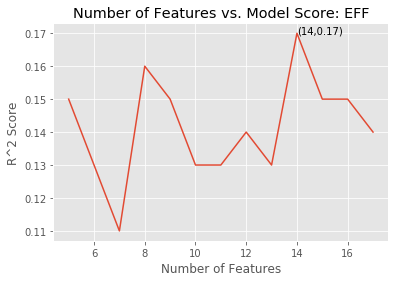


## PIR results

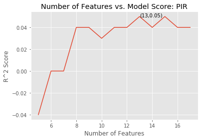

## +/- results

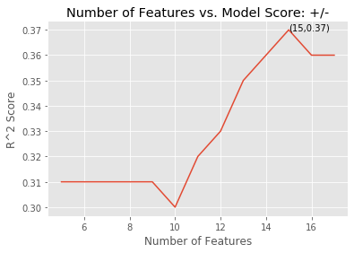

## Individual Player Features Model Summary

#### Optimized Individual Player EFF: 14 players, cross validated R^2 of 0.17 | Optimized Individual Player PIR: 13 players, R^2 of 0.05 | Optimized Individual Player +/-:  15 players, R^2 of 0.37

When creating hierarchical rankings within teams, individual Player +/- is the most informative to a team's regular season success within the context of a Gradient Boosting model built on individual player values for a particular efficiency metric. Perhaps this is because +/- does the best job of capturing a player's ability to synergize with his teammates as it prioritizes a team's success when a player is on the floor, versus the individual player's stat-line. For example, if a player puts up 50 points, 20 assists, and 20 rebounds on a given night, but his team loses and his +/- score is negative, one could argue his amazing statline was just 'empty production' as it didn't do his team any good in terms of winning the game.


## So we know which feature level and individual efficiency metric (15,+/-) performs the best for the above models. Let's take a peak at feature importances to see if we can pinpoint which features are most informative.

#### Feature importances can be a bit misleading. While they describe the extent to which a feature helps a model make accurate predictions, they don't describe directionality, nor correlation of the features to a particular target. 
#### For sake of testing the relationship of each feature to the target, we'll conduct a Pearson R test for correlation within each feature.
#### The Pearson R has the following assumptions: 
1) Parallel level of measurement: both variables are continuous (check). 
2) Related pairs: every wins value is paired to a player efficiency score (check). 
3) Absence of outliers: let's run through once and then alter if we need to. 
4) Linearity: visually test with scatter plot and Pearson R p-value. We'll use an alpha of 0.05 as our threshold of statistical significance. 

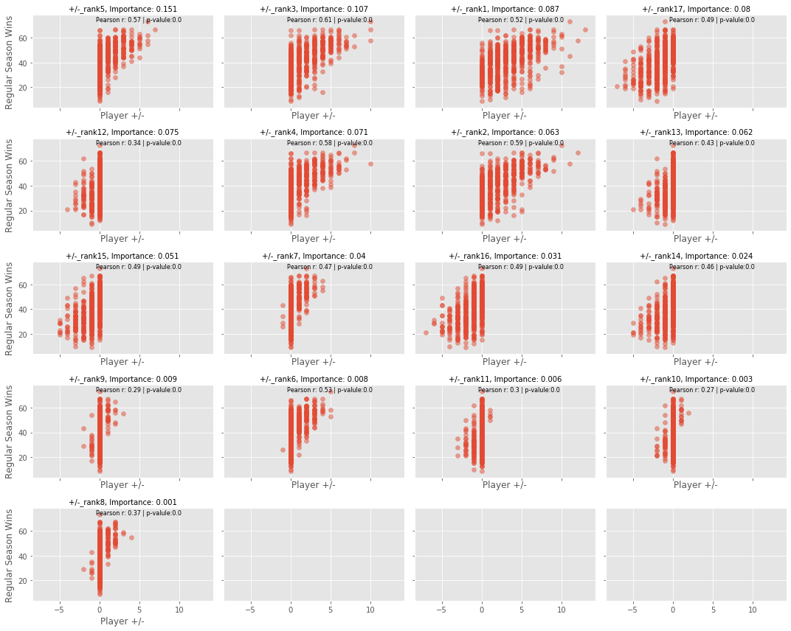

### Feature importance was not parallel to the hierarchical rankings of player +/- within each team. 
This suggests that bench players (ranks 6 and below) play an important role in predicting a team's success for a given season, at least, within a gradient boosted regression context. Across all features, individual player +/- scores were positively correlated to regular season wins to a statistically significant degree. Does this hold true for both EFF and PIR?

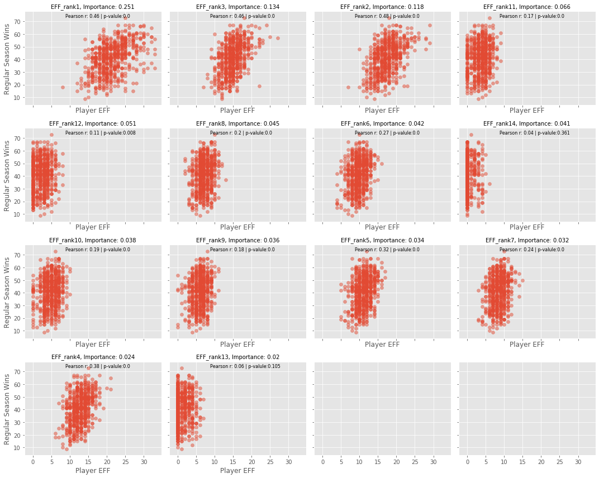

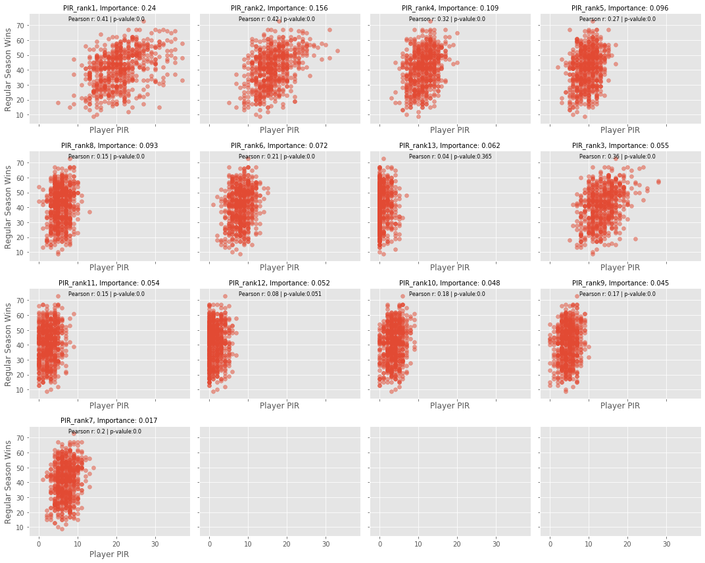


### Looks like for the most part, linear relationships exist between EFF/PIR and wins. 
Exceptions: EFF - rank 13, rank 14 | PIR - rank 13, rank 12

### But it seems the Pearson r values for Player +/- and wins is higher across rankings than those of EFF and PIR. Let's confirm.  


```python
for idx in range(0,17):
    print(f'{eff_pr[idx]} | {pir_pr[idx]} | {pm_pr[idx]}')
```

    EFF_rank1 - r: 0.46, p: 0.0    | PIR_rank1 - r: 0.41, p: 0.0    | +/-_rank1 - r: 0.52, p: 0.0
    EFF_rank2 - r: 0.48, p: 0.0    | PIR_rank2 - r: 0.42, p: 0.0    | +/-_rank2 - r: 0.59, p: 0.0
    EFF_rank3 - r: 0.46, p: 0.0    | PIR_rank3 - r: 0.36, p: 0.0    | +/-_rank3 - r: 0.61, p: 0.0
    EFF_rank4 - r: 0.38, p: 0.0    | PIR_rank4 - r: 0.32, p: 0.0    | +/-_rank4 - r: 0.58, p: 0.0
    EFF_rank5 - r: 0.32, p: 0.0    | PIR_rank5 - r: 0.27, p: 0.0    | +/-_rank5 - r: 0.57, p: 0.0
    EFF_rank6 - r: 0.27, p: 0.0    | PIR_rank6 - r: 0.21, p: 0.0    | +/-_rank6 - r: 0.53, p: 0.0
    EFF_rank7 - r: 0.24, p: 0.0    | PIR_rank7 - r: 0.2, p: 0.0     | +/-_rank7 - r: 0.47, p: 0.0
    EFF_rank8 - r: 0.2, p: 0.0     | PIR_rank8 - r: 0.15, p: 0.0    | +/-_rank8 - r: 0.37, p: 0.0
    EFF_rank9 - r: 0.18, p: 0.0    | PIR_rank9 - r: 0.17, p: 0.0    | +/-_rank9 - r: 0.29, p: 0.0
    EFF_rank10 - r: 0.19, p: 0.0   | PIR_rank10 - r: 0.18, p: 0.0   | +/-_rank10 - r: 0.27, p: 0.0
    EFF_rank11 - r: 0.17, p: 0.0   | PIR_rank11 - r: 0.15, p: 0.0   | +/-_rank11 - r: 0.3, p: 0.0
    EFF_rank12 - r: 0.11, p: 0.008 | PIR_rank12 - r: 0.08, p: 0.051 | +/-_rank12 - r: 0.34, p: 0.0
    EFF_rank13 - r: 0.06, p: 0.105 | PIR_rank13 - r: 0.04, p: 0.365 | +/-_rank13 - r: 0.43, p: 0.0
    EFF_rank14 - r: 0.04, p: 0.361 | PIR_rank14 - r: 0.04, p: 0.357 | +/-_rank14 - r: 0.46, p: 0.0
    EFF_rank15 - r: 0.03, p: 0.467 | PIR_rank15 - r: 0.02, p: 0.668 | +/-_rank15 - r: 0.49, p: 0.0
    EFF_rank16 - r: 0.02, p: 0.558 | PIR_rank16 - r: 0.03, p: 0.393 | +/-_rank16 - r: 0.49, p: 0.0
    EFF_rank17 - r: 0.01, p: 0.789 | PIR_rank17 - r: -0.0, p: 0.927 | +/-_rank17 - r: 0.49, p: 0.0


Across the board, individual player +/-  is more strongly correlated with regular season wins than EFF and PIR

## However, the top R^2 of 0.37 from our Gradient Boosting models (+/-, 15 players) still leaves plenty to be desired. Let's pivot to some aggregated team statistics and see if those are more informative. 

Here's what the features and targets look like for team average efficiency metrics:
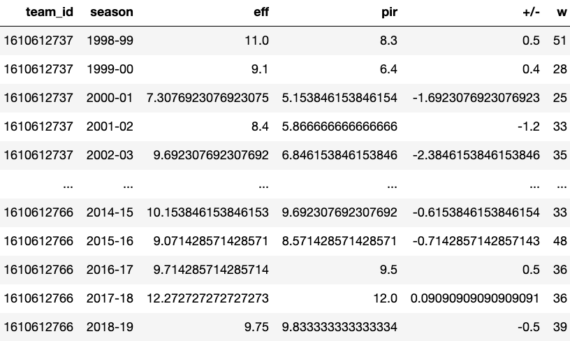

```python
score_team(['eff','pir','+/-'])
```

    Aggregate team statistics model score: 0.394


### So we've improved about .024 from our individual +/- model before to R^2 =~0.394.
While this improvement is slight, it suggests that considering a team's average efficiency across all three metrics may be more informative to regular season success than the roster's individual efficiency values.

### Time for another round of feature importance analysis.

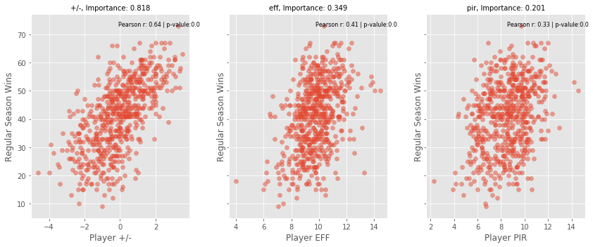


## Feature Importance by Average Team Stats Summary
Consistent with the prior models focusing on one efficiency metric, all three metrics show a significant linear relatiopnship with regular season wins. Again, +/- shines as the most useful in predicting a team's regular season wins. More than twice as much as EFF and four times as much as PIR. There also appears to be a parallel relationship between an efficiency metric's Pearson r value and feature importance for this particular model.

## Let's try and beat an R^2 of 0.394.
Idea: because an inclusion of all three efficiency metrics seemed to improve our model above, let's fit the model including the individual player efficiency score for all three metrics. 


```python
# Generate dataframes for all three metrics
    
df_X_eff = gen_X(teams,seasons,'eff')
df_X_pir = gen_X(teams,seasons,'pir')
df_X_pm = gen_X(teams,seasons,'+/-')
```


```python
# join dataframes

df_m1 = pd.merge(df_X_eff,df_X_pir, on = ['team_id','season'], how='inner')
df_all_ind = pd.merge(df_m1,df_X_pm, on = ['team_id','season'], how='inner')
```


```python
X = get_y(df_all_ind,df_team,['w'])
y_w = X['w']
X = X.drop(columns=['team_id','season','w'])
```


```python
# Fit and score

gb_w = GradientBoostingRegressor()
print(f'Cross Validation R^2 Score including all individual efficiency scores across metrics: {round(np.mean(cross_val_score(gb_w,X,y_w,cv=5)),3)}')
```

    Cross Validation R^2 Score including all individual efficiency scores across metrics: 0.37


### Shoot, our score actually dropped slightly from just the team averages for each efficiency metric, and it performed no better than fitting on individual +/- scores from the prior season. 
The average efficiency metric scores within teams is more informative to predicting regular season results across teams than all individual metric scores.
Let's try one more, super simple model. A roster's average +/- based on the prior season.


```python
score_team(['+/-'])
```

    Aggregate team statistics model score: 0.313


The results above are the worst of any model for which we've used prior season +/- as a feature. Again, the best R^2 value of 0.394 was generated from average team efficiency on all three metrics, so it does seem that in tandem, EFF and PIR can help further inform the model working alongside +/-. Albeit the all models have done a relatively poor job of predicting regular season wins.

# Conclusion

Within the context of Gradient Boosting regression modeling, the NBA efficiency metric of a player's prior season +/- is the most predictive of regular season success based on a team's roster at the beginning of a season, both on an individual player and team average basis in comparison to prior season EFF and prior season PIR.

Across all levels in player hierarchy for a given team, +/- is more strongly correlated to regular season wins than EFF and PIR. 

This suggests that +/- may be the most comprehensive measurement of a player's efficiency in contributing to a team winning games. While +/- takes into account scoring differentials during a player's time on the court, EFF and PIR only take into account the changes in the individual player's statline.

#### Possible Implication
Coaches and management should prioritize a player's +/- scores over EFF and PIR when making adjustments to either in-game lineups or the team roster.

#### Bottom line: 
Of all the modeling approaches taken in this study, the best cross validated R^2 score we generated was 0.394 (team averages for EFF, PIR, +/-). While a positive linear relationship exists between all three efficiency metrics from the prior year and regular season wins, on their own, these efficiency metrics do a mediocre job of predicting regular season wins. 

This makes sense given the plethora of confounding variables that determine a team's regular season success (e.g., trades, injuries, load management, intra-team conflict, etc...)

# Further Study:
-Employ different model types and see if the relationship between efficiency metrics is upheld.

-Investigate the predicitivity of a player's propensity for injury or being traded, and how that in interaction with efficiency metrics may effect regular season wins. 

-Compare efficiency metrics' predictivity versus more conventional NBA statistics, e.g., points scored, field goal percentage, minutes played.

-Test 'Big 3' theory. Is there a sweet spot of the number of elite players per team that optimizes a season's outcomes? Is there an inflection point at which having too many high ranking EFF and PIR players on a roster has an adverse effect on player +/- values, and therefore a team's success?

### Contact info:
LinkedIn: https://www.linkedin.com/in/joshangelchik/